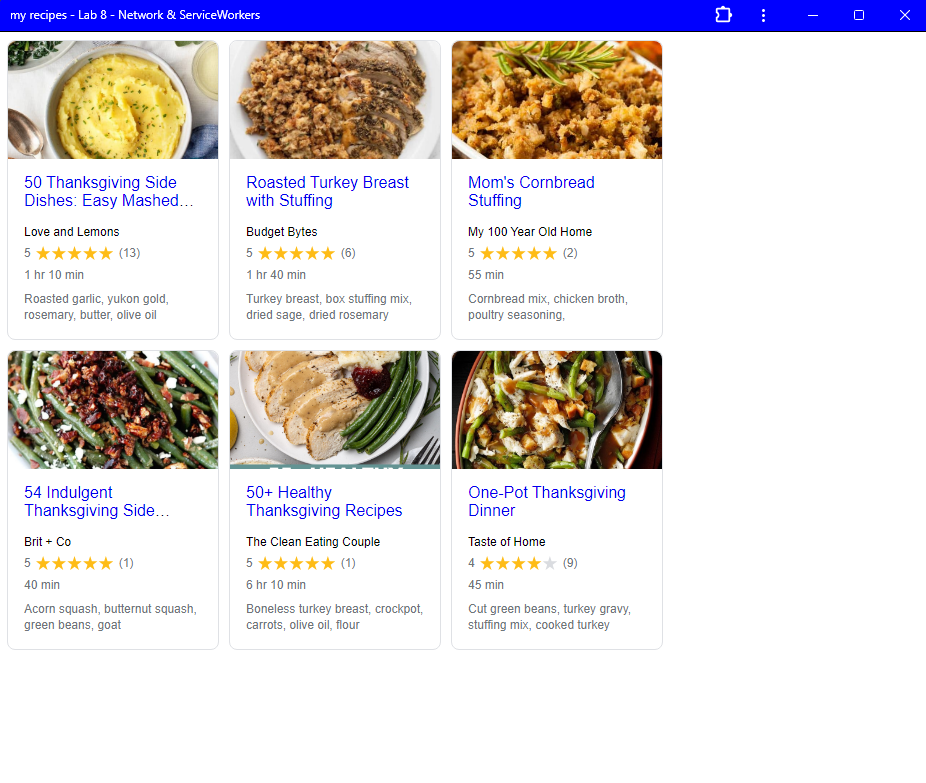

# Lab8-Starter

Charlie Trinh

https://charlitoes.github.io/Lab8-Starter/

paragraph about graceful degradation and service workers relations

Service workers allow for more features such as offline capabilities, background syncing, and push notifications. However some older browsers don't support those features, but if they do not support those features the webpage still functions as it should. An example would be if the application used service workers to provide offline access as in the lab, but if the browser didn't support that feature, then the webpage should still be able to function properly with an internet connection.

  
